# START OF BASIC IMPORTING


```python
import pandas as pd
import matplotlib.pyplot as plt
import seaborn as sns
import numpy as np
```


```python
df = pd.read_csv('Desktop/school/KAG_conversion_data.csv') #import data
```


```python
df.head()
```


<div>
<style scoped>
    .dataframe tbody tr th:only-of-type {
        vertical-align: middle;
    }

    .dataframe tbody tr th {
        vertical-align: top;
    }

    .dataframe thead th {
        text-align: right;
    }
</style>
<table border="1" class="dataframe">
  <thead>
    <tr style="text-align: right;">
      <th></th>
      <th>ad_id</th>
      <th>xyz_campaign_id</th>
      <th>fb_campaign_id</th>
      <th>age</th>
      <th>gender</th>
      <th>interest</th>
      <th>Impressions</th>
      <th>Clicks</th>
      <th>Spent</th>
      <th>Total_Conversion</th>
      <th>Approved_Conversion</th>
      <th>Click_through_rate</th>
      <th>Click_conversion_rate</th>
      <th>Click_approved_conversion_rate</th>
      <th>Cost_per_click</th>
      <th>Cost_per_conversion</th>
      <th>Clicks_normalized</th>
      <th>Impressions_normalized</th>
      <th>Spent_normalized</th>
      <th>Total_Conversion_normalized</th>
    </tr>
  </thead>
  <tbody>
    <tr>
      <th>0</th>
      <td>708746</td>
      <td>916</td>
      <td>103916</td>
      <td>32</td>
      <td>1</td>
      <td>15</td>
      <td>7350</td>
      <td>1</td>
      <td>1.43</td>
      <td>2</td>
      <td>1</td>
      <td>0.013605</td>
      <td>200.000000</td>
      <td>100.0</td>
      <td>1.43</td>
      <td>0.715</td>
      <td>0.000000</td>
      <td>8.902456</td>
      <td>0.357674</td>
      <td>0.693147</td>
    </tr>
    <tr>
      <th>1</th>
      <td>708749</td>
      <td>916</td>
      <td>103917</td>
      <td>32</td>
      <td>1</td>
      <td>16</td>
      <td>17861</td>
      <td>2</td>
      <td>1.82</td>
      <td>2</td>
      <td>0</td>
      <td>0.011198</td>
      <td>100.000000</td>
      <td>0.0</td>
      <td>0.91</td>
      <td>0.910</td>
      <td>0.693147</td>
      <td>9.790375</td>
      <td>0.598837</td>
      <td>0.693147</td>
    </tr>
    <tr>
      <th>3</th>
      <td>708815</td>
      <td>916</td>
      <td>103928</td>
      <td>32</td>
      <td>1</td>
      <td>28</td>
      <td>4259</td>
      <td>1</td>
      <td>1.25</td>
      <td>1</td>
      <td>0</td>
      <td>0.023480</td>
      <td>100.000000</td>
      <td>0.0</td>
      <td>1.25</td>
      <td>1.250</td>
      <td>0.000000</td>
      <td>8.356790</td>
      <td>0.223144</td>
      <td>0.000000</td>
    </tr>
    <tr>
      <th>4</th>
      <td>708818</td>
      <td>916</td>
      <td>103928</td>
      <td>32</td>
      <td>1</td>
      <td>28</td>
      <td>4133</td>
      <td>1</td>
      <td>1.29</td>
      <td>1</td>
      <td>1</td>
      <td>0.024195</td>
      <td>100.000000</td>
      <td>100.0</td>
      <td>1.29</td>
      <td>1.290</td>
      <td>0.000000</td>
      <td>8.326759</td>
      <td>0.254642</td>
      <td>0.000000</td>
    </tr>
    <tr>
      <th>6</th>
      <td>708889</td>
      <td>916</td>
      <td>103940</td>
      <td>32</td>
      <td>1</td>
      <td>15</td>
      <td>15615</td>
      <td>3</td>
      <td>4.77</td>
      <td>1</td>
      <td>0</td>
      <td>0.019212</td>
      <td>33.333333</td>
      <td>0.0</td>
      <td>1.59</td>
      <td>4.770</td>
      <td>1.098612</td>
      <td>9.655987</td>
      <td>1.562346</td>
      <td>0.000000</td>
    </tr>
  </tbody>
</table>
</div>


# START OF DATA EXPLORATION


```python
df.dtypes #valye types
```


    ad_id                               int64
    xyz_campaign_id                     int64
    fb_campaign_id                      int64
    age                                 int64
    gender                              int64
    interest                            int64
    Impressions                         int64
    Clicks                              int64
    Spent                             float64
    Total_Conversion                    int64
    Approved_Conversion                 int64
    Click_through_rate                float64
    Click_conversion_rate             float64
    Click_approved_conversion_rate    float64
    Cost_per_click                    float64
    Cost_per_conversion               float64
    Clicks_normalized                 float64
    Impressions_normalized            float64
    Spent_normalized                  float64
    Total_Conversion_normalized       float64
    dtype: object


```python
df.shape #variable counts
```


    (936, 16)


```python
df.info()
```

    <class 'pandas.core.frame.DataFrame'>
    RangeIndex: 1143 entries, 0 to 1142
    Data columns (total 11 columns):
    ad_id                  1143 non-null int64
    xyz_campaign_id        1143 non-null int64
    fb_campaign_id         1143 non-null int64
    age                    1143 non-null object
    gender                 1143 non-null object
    interest               1143 non-null int64
    Impressions            1143 non-null int64
    Clicks                 1143 non-null int64
    Spent                  1143 non-null float64
    Total_Conversion       1143 non-null int64
    Approved_Conversion    1143 non-null int64
    dtypes: float64(1), int64(8), object(2)
    memory usage: 98.3+ KB


```python
df.age.value_counts(dropna=False)
```


    32    307
    47    231
    37    211
    42    187
    Name: age, dtype: int64


```python
df.ad_id.value_counts(dropna=False).head()
```


    1122303    1
    1121141    1
    1121131    1
    1121132    1
    1121133    1
    Name: ad_id, dtype: int64


```python
df.describe()
```


<div>
<style scoped>
    .dataframe tbody tr th:only-of-type {
        vertical-align: middle;
    }

    .dataframe tbody tr th {
        vertical-align: top;
    }

    .dataframe thead th {
        text-align: right;
    }
</style>
<table border="1" class="dataframe">
  <thead>
    <tr style="text-align: right;">
      <th></th>
      <th>ad_id</th>
      <th>xyz_campaign_id</th>
      <th>fb_campaign_id</th>
      <th>age</th>
      <th>gender</th>
      <th>interest</th>
      <th>Impressions</th>
      <th>Clicks</th>
      <th>Spent</th>
      <th>Total_Conversion</th>
      <th>Approved_Conversion</th>
      <th>Click_through_rate</th>
      <th>Click_conversion_rate</th>
      <th>Click_approved_conversion_rate</th>
      <th>Cost_per_click</th>
      <th>Cost_per_conversion</th>
      <th>Clicks_normalized</th>
      <th>Impressions_normalized</th>
      <th>Spent_normalized</th>
      <th>Total_Conversion_normalized</th>
    </tr>
  </thead>
  <tbody>
    <tr>
      <th>count</th>
      <td>9.360000e+02</td>
      <td>936.000000</td>
      <td>936.000000</td>
      <td>936.000000</td>
      <td>936.000000</td>
      <td>936.000000</td>
      <td>9.360000e+02</td>
      <td>936.000000</td>
      <td>936.000000</td>
      <td>936.000000</td>
      <td>936.000000</td>
      <td>936.000000</td>
      <td>936.000000</td>
      <td>936.000000</td>
      <td>936.000000</td>
      <td>936.00000</td>
      <td>936.000000</td>
      <td>936.000000</td>
      <td>936.000000</td>
      <td>936.000000</td>
    </tr>
    <tr>
      <th>mean</th>
      <td>1.023657e+06</td>
      <td>1093.741453</td>
      <td>137593.010684</td>
      <td>38.826923</td>
      <td>0.505342</td>
      <td>34.210470</td>
      <td>2.275064e+05</td>
      <td>40.774573</td>
      <td>62.719263</td>
      <td>3.260684</td>
      <td>1.071581</td>
      <td>0.020051</td>
      <td>29.515203</td>
      <td>10.903023</td>
      <td>1.499347</td>
      <td>inf</td>
      <td>2.608210</td>
      <td>11.223449</td>
      <td>2.997390</td>
      <td>-inf</td>
    </tr>
    <tr>
      <th>std</th>
      <td>1.891542e+05</td>
      <td>116.195656</td>
      <td>20349.163125</td>
      <td>5.879900</td>
      <td>0.500239</td>
      <td>28.622745</td>
      <td>3.320917e+05</td>
      <td>60.431102</td>
      <td>92.260964</td>
      <td>4.861548</td>
      <td>1.880438</td>
      <td>0.009423</td>
      <td>38.724016</td>
      <td>24.703240</td>
      <td>0.232879</td>
      <td>NaN</td>
      <td>1.639600</td>
      <td>1.705300</td>
      <td>1.711276</td>
      <td>NaN</td>
    </tr>
    <tr>
      <th>min</th>
      <td>7.087460e+05</td>
      <td>916.000000</td>
      <td>103916.000000</td>
      <td>32.000000</td>
      <td>0.000000</td>
      <td>2.000000</td>
      <td>9.440000e+02</td>
      <td>1.000000</td>
      <td>0.180000</td>
      <td>0.000000</td>
      <td>0.000000</td>
      <td>0.003066</td>
      <td>0.000000</td>
      <td>0.000000</td>
      <td>0.180000</td>
      <td>0.18000</td>
      <td>0.000000</td>
      <td>6.850126</td>
      <td>-1.714798</td>
      <td>-inf</td>
    </tr>
    <tr>
      <th>25%</th>
      <td>7.803218e+05</td>
      <td>936.000000</td>
      <td>116183.000000</td>
      <td>32.000000</td>
      <td>0.000000</td>
      <td>16.000000</td>
      <td>1.907125e+04</td>
      <td>3.000000</td>
      <td>4.615000</td>
      <td>1.000000</td>
      <td>0.000000</td>
      <td>0.013685</td>
      <td>5.870098</td>
      <td>0.000000</td>
      <td>1.390000</td>
      <td>4.05000</td>
      <td>1.098612</td>
      <td>9.855930</td>
      <td>1.529310</td>
      <td>0.000000</td>
    </tr>
    <tr>
      <th>50%</th>
      <td>1.121376e+06</td>
      <td>1178.000000</td>
      <td>144586.000000</td>
      <td>37.000000</td>
      <td>1.000000</td>
      <td>25.000000</td>
      <td>9.833600e+04</td>
      <td>16.000000</td>
      <td>24.895000</td>
      <td>1.000000</td>
      <td>1.000000</td>
      <td>0.018243</td>
      <td>12.876830</td>
      <td>1.253931</td>
      <td>1.498273</td>
      <td>12.07500</td>
      <td>2.772589</td>
      <td>11.496142</td>
      <td>3.214656</td>
      <td>0.000000</td>
    </tr>
    <tr>
      <th>75%</th>
      <td>1.121902e+06</td>
      <td>1178.000000</td>
      <td>144674.000000</td>
      <td>42.000000</td>
      <td>1.000000</td>
      <td>31.000000</td>
      <td>2.829668e+05</td>
      <td>50.000000</td>
      <td>76.700000</td>
      <td>3.000000</td>
      <td>1.000000</td>
      <td>0.024749</td>
      <td>33.333333</td>
      <td>6.666667</td>
      <td>1.644364</td>
      <td>26.65875</td>
      <td>3.912023</td>
      <td>12.553085</td>
      <td>4.339902</td>
      <td>1.098612</td>
    </tr>
    <tr>
      <th>max</th>
      <td>1.314415e+06</td>
      <td>1178.000000</td>
      <td>179982.000000</td>
      <td>47.000000</td>
      <td>1.000000</td>
      <td>114.000000</td>
      <td>3.052003e+06</td>
      <td>421.000000</td>
      <td>639.949998</td>
      <td>60.000000</td>
      <td>21.000000</td>
      <td>0.105932</td>
      <td>400.000000</td>
      <td>200.000000</td>
      <td>2.212000</td>
      <td>inf</td>
      <td>6.042633</td>
      <td>14.931309</td>
      <td>6.461390</td>
      <td>4.094345</td>
    </tr>
  </tbody>
</table>
</div>


```python
df.Impressions.plot('hist')
```


    <matplotlib.axes._subplots.AxesSubplot at 0x1a1b7a6e80>


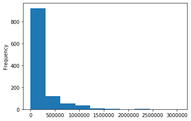


```python
df.boxplot(column='Impressions', by='age')
```


    <matplotlib.axes._subplots.AxesSubplot at 0x1a1a8a5470>


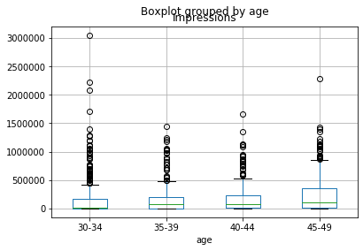


```python
df.Impressions.describe()
```


    count    1.143000e+03
    mean     1.867321e+05
    std      3.127622e+05
    min      8.700000e+01
    25%      6.503500e+03
    50%      5.150900e+04
    75%      2.217690e+05
    max      3.052003e+06
    Name: Impressions, dtype: float64


```python
df.plot(kind='scatter', x='Impressions', y='Clicks', rot=70)
plt.show()
```


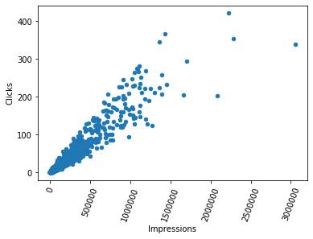


```python
df.Clicks.describe()
```


    count    1143.000000
    mean       33.390201
    std        56.892438
    min         0.000000
    25%         1.000000
    50%         8.000000
    75%        37.500000
    max       421.000000
    Name: Clicks, dtype: float64


```python
df.Clicks.plot('hist')
```


    <matplotlib.axes._subplots.AxesSubplot at 0x1a1b864278>


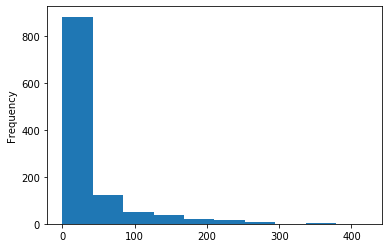


```python
df.boxplot(column='Clicks', by='age')
```


    <matplotlib.axes._subplots.AxesSubplot at 0x1a1b9ea588>


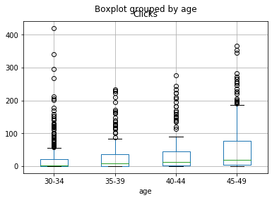


```python
df.plot(kind='scatter', x='Clicks', y='Total_Conversion', rot=70)
```


    <matplotlib.axes._subplots.AxesSubplot at 0x1a1cc19198>


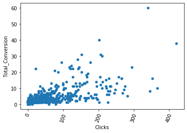


```python
df.Spent.describe()
```


    count    1143.000000
    mean       51.360656
    std        86.908418
    min         0.000000
    25%         1.480000
    50%        12.370000
    75%        60.025000
    max       639.949998
    Name: Spent, dtype: float64


```python
df.Spent.plot('hist')
```


    <matplotlib.axes._subplots.AxesSubplot at 0x1a1cd05080>


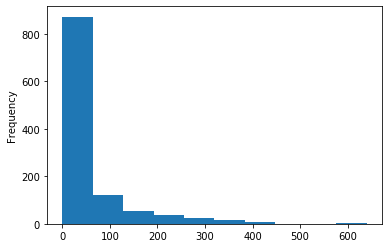


```python
df.boxplot(column='Spent', by='age')
```


    <matplotlib.axes._subplots.AxesSubplot at 0x1a1cd05a58>


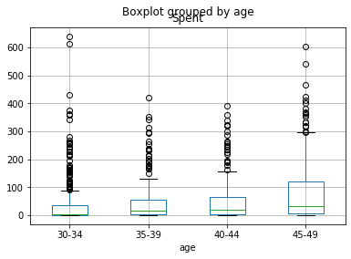


```python
df.plot(kind='scatter', x='Spent', y='Total_Conversion', rot=70)
```


    <matplotlib.axes._subplots.AxesSubplot at 0x1a1ced9898>


```python
df
```


<div>
<style scoped>
    .dataframe tbody tr th:only-of-type {
        vertical-align: middle;
    }

    .dataframe tbody tr th {
        vertical-align: top;
    }

    .dataframe thead th {
        text-align: right;
    }
</style>
<table border="1" class="dataframe">
  <thead>
    <tr style="text-align: right;">
      <th></th>
      <th>ad_id</th>
      <th>xyz_campaign_id</th>
      <th>fb_campaign_id</th>
      <th>age</th>
      <th>gender</th>
      <th>interest</th>
      <th>Impressions</th>
      <th>Clicks</th>
      <th>Spent</th>
      <th>Total_Conversion</th>
      <th>Approved_Conversion</th>
      <th>Click_through_rate</th>
      <th>Click_conversion_rate</th>
      <th>Click_approved_conversion_rate</th>
      <th>Cost_per_click</th>
      <th>Cost_per_conversion</th>
      <th>Clicks_normalized</th>
    </tr>
  </thead>
  <tbody>
    <tr>
      <th>0</th>
      <td>708746</td>
      <td>916</td>
      <td>103916</td>
      <td>30-34</td>
      <td>1</td>
      <td>15</td>
      <td>7350</td>
      <td>1</td>
      <td>1.430000</td>
      <td>2</td>
      <td>1</td>
      <td>0.013605</td>
      <td>200.000000</td>
      <td>100.000000</td>
      <td>1.430000</td>
      <td>0.715000</td>
      <td>AxesSubplot(0.125,0.125;0.775x0.755)</td>
    </tr>
    <tr>
      <th>1</th>
      <td>708749</td>
      <td>916</td>
      <td>103917</td>
      <td>30-34</td>
      <td>1</td>
      <td>16</td>
      <td>17861</td>
      <td>2</td>
      <td>1.820000</td>
      <td>2</td>
      <td>0</td>
      <td>0.011198</td>
      <td>100.000000</td>
      <td>0.000000</td>
      <td>0.910000</td>
      <td>0.910000</td>
      <td>AxesSubplot(0.125,0.125;0.775x0.755)</td>
    </tr>
    <tr>
      <th>3</th>
      <td>708815</td>
      <td>916</td>
      <td>103928</td>
      <td>30-34</td>
      <td>1</td>
      <td>28</td>
      <td>4259</td>
      <td>1</td>
      <td>1.250000</td>
      <td>1</td>
      <td>0</td>
      <td>0.023480</td>
      <td>100.000000</td>
      <td>0.000000</td>
      <td>1.250000</td>
      <td>1.250000</td>
      <td>AxesSubplot(0.125,0.125;0.775x0.755)</td>
    </tr>
    <tr>
      <th>4</th>
      <td>708818</td>
      <td>916</td>
      <td>103928</td>
      <td>30-34</td>
      <td>1</td>
      <td>28</td>
      <td>4133</td>
      <td>1</td>
      <td>1.290000</td>
      <td>1</td>
      <td>1</td>
      <td>0.024195</td>
      <td>100.000000</td>
      <td>100.000000</td>
      <td>1.290000</td>
      <td>1.290000</td>
      <td>AxesSubplot(0.125,0.125;0.775x0.755)</td>
    </tr>
    <tr>
      <th>6</th>
      <td>708889</td>
      <td>916</td>
      <td>103940</td>
      <td>30-34</td>
      <td>1</td>
      <td>15</td>
      <td>15615</td>
      <td>3</td>
      <td>4.770000</td>
      <td>1</td>
      <td>0</td>
      <td>0.019212</td>
      <td>33.333333</td>
      <td>0.000000</td>
      <td>1.590000</td>
      <td>4.770000</td>
      <td>AxesSubplot(0.125,0.125;0.775x0.755)</td>
    </tr>
    <tr>
      <th>7</th>
      <td>708895</td>
      <td>916</td>
      <td>103941</td>
      <td>30-34</td>
      <td>1</td>
      <td>16</td>
      <td>10951</td>
      <td>1</td>
      <td>1.270000</td>
      <td>1</td>
      <td>1</td>
      <td>0.009132</td>
      <td>100.000000</td>
      <td>100.000000</td>
      <td>1.270000</td>
      <td>1.270000</td>
      <td>AxesSubplot(0.125,0.125;0.775x0.755)</td>
    </tr>
    <tr>
      <th>8</th>
      <td>708953</td>
      <td>916</td>
      <td>103951</td>
      <td>30-34</td>
      <td>1</td>
      <td>27</td>
      <td>2355</td>
      <td>1</td>
      <td>1.500000</td>
      <td>1</td>
      <td>0</td>
      <td>0.042463</td>
      <td>100.000000</td>
      <td>0.000000</td>
      <td>1.500000</td>
      <td>1.500000</td>
      <td>AxesSubplot(0.125,0.125;0.775x0.755)</td>
    </tr>
    <tr>
      <th>9</th>
      <td>708958</td>
      <td>916</td>
      <td>103952</td>
      <td>30-34</td>
      <td>1</td>
      <td>28</td>
      <td>9502</td>
      <td>3</td>
      <td>3.160000</td>
      <td>1</td>
      <td>0</td>
      <td>0.031572</td>
      <td>33.333333</td>
      <td>0.000000</td>
      <td>1.053333</td>
      <td>3.160000</td>
      <td>AxesSubplot(0.125,0.125;0.775x0.755)</td>
    </tr>
    <tr>
      <th>14</th>
      <td>709059</td>
      <td>916</td>
      <td>103968</td>
      <td>30-34</td>
      <td>1</td>
      <td>20</td>
      <td>14669</td>
      <td>7</td>
      <td>10.280000</td>
      <td>1</td>
      <td>1</td>
      <td>0.047720</td>
      <td>14.285714</td>
      <td>14.285714</td>
      <td>1.468571</td>
      <td>10.280000</td>
      <td>AxesSubplot(0.125,0.125;0.775x0.755)</td>
    </tr>
    <tr>
      <th>16</th>
      <td>709115</td>
      <td>916</td>
      <td>103978</td>
      <td>30-34</td>
      <td>1</td>
      <td>30</td>
      <td>2305</td>
      <td>1</td>
      <td>0.570000</td>
      <td>1</td>
      <td>0</td>
      <td>0.043384</td>
      <td>100.000000</td>
      <td>0.000000</td>
      <td>0.570000</td>
      <td>0.570000</td>
      <td>AxesSubplot(0.125,0.125;0.775x0.755)</td>
    </tr>
    <tr>
      <th>18</th>
      <td>709179</td>
      <td>916</td>
      <td>103988</td>
      <td>35-39</td>
      <td>1</td>
      <td>15</td>
      <td>4627</td>
      <td>1</td>
      <td>1.690000</td>
      <td>1</td>
      <td>0</td>
      <td>0.021612</td>
      <td>100.000000</td>
      <td>0.000000</td>
      <td>1.690000</td>
      <td>1.690000</td>
      <td>AxesSubplot(0.125,0.125;0.775x0.755)</td>
    </tr>
    <tr>
      <th>19</th>
      <td>709183</td>
      <td>916</td>
      <td>103989</td>
      <td>35-39</td>
      <td>1</td>
      <td>16</td>
      <td>21026</td>
      <td>4</td>
      <td>4.630000</td>
      <td>2</td>
      <td>1</td>
      <td>0.019024</td>
      <td>50.000000</td>
      <td>25.000000</td>
      <td>1.157500</td>
      <td>2.315000</td>
      <td>AxesSubplot(0.125,0.125;0.775x0.755)</td>
    </tr>
    <tr>
      <th>21</th>
      <td>709323</td>
      <td>916</td>
      <td>104012</td>
      <td>35-39</td>
      <td>1</td>
      <td>15</td>
      <td>7132</td>
      <td>2</td>
      <td>2.610000</td>
      <td>1</td>
      <td>0</td>
      <td>0.028043</td>
      <td>50.000000</td>
      <td>0.000000</td>
      <td>1.305000</td>
      <td>2.610000</td>
      <td>AxesSubplot(0.125,0.125;0.775x0.755)</td>
    </tr>
    <tr>
      <th>22</th>
      <td>709326</td>
      <td>916</td>
      <td>104013</td>
      <td>35-39</td>
      <td>1</td>
      <td>16</td>
      <td>12190</td>
      <td>2</td>
      <td>3.050000</td>
      <td>1</td>
      <td>0</td>
      <td>0.016407</td>
      <td>50.000000</td>
      <td>0.000000</td>
      <td>1.525000</td>
      <td>3.050000</td>
      <td>AxesSubplot(0.125,0.125;0.775x0.755)</td>
    </tr>
    <tr>
      <th>23</th>
      <td>709327</td>
      <td>916</td>
      <td>104013</td>
      <td>35-39</td>
      <td>1</td>
      <td>16</td>
      <td>12193</td>
      <td>2</td>
      <td>3.060000</td>
      <td>1</td>
      <td>1</td>
      <td>0.016403</td>
      <td>50.000000</td>
      <td>50.000000</td>
      <td>1.530000</td>
      <td>3.060000</td>
      <td>AxesSubplot(0.125,0.125;0.775x0.755)</td>
    </tr>
    <tr>
      <th>26</th>
      <td>709544</td>
      <td>916</td>
      <td>104049</td>
      <td>35-39</td>
      <td>1</td>
      <td>29</td>
      <td>7440</td>
      <td>2</td>
      <td>2.980000</td>
      <td>1</td>
      <td>1</td>
      <td>0.026882</td>
      <td>50.000000</td>
      <td>50.000000</td>
      <td>1.490000</td>
      <td>2.980000</td>
      <td>AxesSubplot(0.125,0.125;0.775x0.755)</td>
    </tr>
    <tr>
      <th>27</th>
      <td>709614</td>
      <td>916</td>
      <td>104061</td>
      <td>40-44</td>
      <td>1</td>
      <td>16</td>
      <td>19113</td>
      <td>4</td>
      <td>5.520000</td>
      <td>1</td>
      <td>0</td>
      <td>0.020928</td>
      <td>25.000000</td>
      <td>0.000000</td>
      <td>1.380000</td>
      <td>5.520000</td>
      <td>AxesSubplot(0.125,0.125;0.775x0.755)</td>
    </tr>
    <tr>
      <th>28</th>
      <td>709756</td>
      <td>916</td>
      <td>104085</td>
      <td>40-44</td>
      <td>1</td>
      <td>16</td>
      <td>10976</td>
      <td>2</td>
      <td>1.690000</td>
      <td>1</td>
      <td>1</td>
      <td>0.018222</td>
      <td>50.000000</td>
      <td>50.000000</td>
      <td>0.845000</td>
      <td>1.690000</td>
      <td>AxesSubplot(0.125,0.125;0.775x0.755)</td>
    </tr>
    <tr>
      <th>31</th>
      <td>709901</td>
      <td>916</td>
      <td>104109</td>
      <td>40-44</td>
      <td>1</td>
      <td>16</td>
      <td>23817</td>
      <td>7</td>
      <td>8.470000</td>
      <td>1</td>
      <td>1</td>
      <td>0.029391</td>
      <td>14.285714</td>
      <td>14.285714</td>
      <td>1.210000</td>
      <td>8.470000</td>
      <td>AxesSubplot(0.125,0.125;0.775x0.755)</td>
    </tr>
    <tr>
      <th>32</th>
      <td>710045</td>
      <td>916</td>
      <td>104133</td>
      <td>45-49</td>
      <td>1</td>
      <td>16</td>
      <td>47224</td>
      <td>12</td>
      <td>15.820000</td>
      <td>1</td>
      <td>0</td>
      <td>0.025411</td>
      <td>8.333333</td>
      <td>0.000000</td>
      <td>1.318333</td>
      <td>15.820000</td>
      <td>AxesSubplot(0.125,0.125;0.775x0.755)</td>
    </tr>
    <tr>
      <th>33</th>
      <td>710088</td>
      <td>916</td>
      <td>104140</td>
      <td>45-49</td>
      <td>1</td>
      <td>24</td>
      <td>2283</td>
      <td>1</td>
      <td>1.470000</td>
      <td>1</td>
      <td>0</td>
      <td>0.043802</td>
      <td>100.000000</td>
      <td>0.000000</td>
      <td>1.470000</td>
      <td>1.470000</td>
      <td>AxesSubplot(0.125,0.125;0.775x0.755)</td>
    </tr>
    <tr>
      <th>34</th>
      <td>710360</td>
      <td>916</td>
      <td>104185</td>
      <td>45-49</td>
      <td>1</td>
      <td>21</td>
      <td>2182</td>
      <td>1</td>
      <td>1.530000</td>
      <td>1</td>
      <td>1</td>
      <td>0.045830</td>
      <td>100.000000</td>
      <td>100.000000</td>
      <td>1.530000</td>
      <td>1.530000</td>
      <td>AxesSubplot(0.125,0.125;0.775x0.755)</td>
    </tr>
    <tr>
      <th>36</th>
      <td>710480</td>
      <td>916</td>
      <td>104205</td>
      <td>30-34</td>
      <td>0</td>
      <td>16</td>
      <td>57665</td>
      <td>14</td>
      <td>18.070000</td>
      <td>1</td>
      <td>1</td>
      <td>0.024278</td>
      <td>7.142857</td>
      <td>7.142857</td>
      <td>1.290714</td>
      <td>18.070000</td>
      <td>AxesSubplot(0.125,0.125;0.775x0.755)</td>
    </tr>
    <tr>
      <th>37</th>
      <td>710571</td>
      <td>916</td>
      <td>104220</td>
      <td>30-34</td>
      <td>0</td>
      <td>32</td>
      <td>3091</td>
      <td>1</td>
      <td>1.610000</td>
      <td>1</td>
      <td>1</td>
      <td>0.032352</td>
      <td>100.000000</td>
      <td>100.000000</td>
      <td>1.610000</td>
      <td>1.610000</td>
      <td>AxesSubplot(0.125,0.125;0.775x0.755)</td>
    </tr>
    <tr>
      <th>38</th>
      <td>710617</td>
      <td>916</td>
      <td>104228</td>
      <td>30-34</td>
      <td>0</td>
      <td>15</td>
      <td>5014</td>
      <td>1</td>
      <td>1.190000</td>
      <td>1</td>
      <td>0</td>
      <td>0.019944</td>
      <td>100.000000</td>
      <td>0.000000</td>
      <td>1.190000</td>
      <td>1.190000</td>
      <td>AxesSubplot(0.125,0.125;0.775x0.755)</td>
    </tr>
    <tr>
      <th>39</th>
      <td>710623</td>
      <td>916</td>
      <td>104229</td>
      <td>30-34</td>
      <td>0</td>
      <td>16</td>
      <td>38726</td>
      <td>7</td>
      <td>9.220000</td>
      <td>1</td>
      <td>0</td>
      <td>0.018076</td>
      <td>14.285714</td>
      <td>0.000000</td>
      <td>1.317143</td>
      <td>9.220000</td>
      <td>AxesSubplot(0.125,0.125;0.775x0.755)</td>
    </tr>
    <tr>
      <th>42</th>
      <td>710763</td>
      <td>916</td>
      <td>104252</td>
      <td>30-34</td>
      <td>0</td>
      <td>15</td>
      <td>5369</td>
      <td>1</td>
      <td>1.510000</td>
      <td>1</td>
      <td>0</td>
      <td>0.018625</td>
      <td>100.000000</td>
      <td>0.000000</td>
      <td>1.510000</td>
      <td>1.510000</td>
      <td>AxesSubplot(0.125,0.125;0.775x0.755)</td>
    </tr>
    <tr>
      <th>43</th>
      <td>710836</td>
      <td>916</td>
      <td>104265</td>
      <td>30-34</td>
      <td>0</td>
      <td>29</td>
      <td>22221</td>
      <td>7</td>
      <td>9.430000</td>
      <td>1</td>
      <td>1</td>
      <td>0.031502</td>
      <td>14.285714</td>
      <td>14.285714</td>
      <td>1.347143</td>
      <td>9.430000</td>
      <td>AxesSubplot(0.125,0.125;0.775x0.755)</td>
    </tr>
    <tr>
      <th>45</th>
      <td>710880</td>
      <td>916</td>
      <td>104272</td>
      <td>30-34</td>
      <td>0</td>
      <td>65</td>
      <td>13019</td>
      <td>5</td>
      <td>6.960000</td>
      <td>1</td>
      <td>0</td>
      <td>0.038405</td>
      <td>20.000000</td>
      <td>0.000000</td>
      <td>1.392000</td>
      <td>6.960000</td>
      <td>AxesSubplot(0.125,0.125;0.775x0.755)</td>
    </tr>
    <tr>
      <th>46</th>
      <td>710961</td>
      <td>916</td>
      <td>104285</td>
      <td>35-39</td>
      <td>0</td>
      <td>25</td>
      <td>2508</td>
      <td>1</td>
      <td>1.220000</td>
      <td>1</td>
      <td>0</td>
      <td>0.039872</td>
      <td>100.000000</td>
      <td>0.000000</td>
      <td>1.220000</td>
      <td>1.220000</td>
      <td>AxesSubplot(0.125,0.125;0.775x0.755)</td>
    </tr>
    <tr>
      <th>...</th>
      <td>...</td>
      <td>...</td>
      <td>...</td>
      <td>...</td>
      <td>...</td>
      <td>...</td>
      <td>...</td>
      <td>...</td>
      <td>...</td>
      <td>...</td>
      <td>...</td>
      <td>...</td>
      <td>...</td>
      <td>...</td>
      <td>...</td>
      <td>...</td>
      <td>...</td>
    </tr>
    <tr>
      <th>1113</th>
      <td>1314384</td>
      <td>1178</td>
      <td>179951</td>
      <td>35-39</td>
      <td>0</td>
      <td>113</td>
      <td>441192</td>
      <td>53</td>
      <td>77.600000</td>
      <td>6</td>
      <td>2</td>
      <td>0.012013</td>
      <td>11.320755</td>
      <td>3.773585</td>
      <td>1.464151</td>
      <td>12.933333</td>
      <td>AxesSubplot(0.125,0.125;0.775x0.755)</td>
    </tr>
    <tr>
      <th>1114</th>
      <td>1314385</td>
      <td>1178</td>
      <td>179952</td>
      <td>35-39</td>
      <td>0</td>
      <td>114</td>
      <td>90470</td>
      <td>11</td>
      <td>16.730000</td>
      <td>1</td>
      <td>1</td>
      <td>0.012159</td>
      <td>9.090909</td>
      <td>9.090909</td>
      <td>1.520909</td>
      <td>16.730000</td>
      <td>AxesSubplot(0.125,0.125;0.775x0.755)</td>
    </tr>
    <tr>
      <th>1115</th>
      <td>1314386</td>
      <td>1178</td>
      <td>179953</td>
      <td>40-44</td>
      <td>0</td>
      <td>100</td>
      <td>834243</td>
      <td>166</td>
      <td>246.749998</td>
      <td>18</td>
      <td>7</td>
      <td>0.019898</td>
      <td>10.843373</td>
      <td>4.216867</td>
      <td>1.486446</td>
      <td>13.708333</td>
      <td>AxesSubplot(0.125,0.125;0.775x0.755)</td>
    </tr>
    <tr>
      <th>1116</th>
      <td>1314387</td>
      <td>1178</td>
      <td>179954</td>
      <td>40-44</td>
      <td>0</td>
      <td>101</td>
      <td>696612</td>
      <td>152</td>
      <td>223.189995</td>
      <td>31</td>
      <td>9</td>
      <td>0.021820</td>
      <td>20.394737</td>
      <td>5.921053</td>
      <td>1.468355</td>
      <td>7.199677</td>
      <td>AxesSubplot(0.125,0.125;0.775x0.755)</td>
    </tr>
    <tr>
      <th>1117</th>
      <td>1314388</td>
      <td>1178</td>
      <td>179955</td>
      <td>40-44</td>
      <td>0</td>
      <td>102</td>
      <td>329333</td>
      <td>48</td>
      <td>67.609999</td>
      <td>1</td>
      <td>0</td>
      <td>0.014575</td>
      <td>2.083333</td>
      <td>0.000000</td>
      <td>1.408542</td>
      <td>67.609999</td>
      <td>AxesSubplot(0.125,0.125;0.775x0.755)</td>
    </tr>
    <tr>
      <th>1118</th>
      <td>1314389</td>
      <td>1178</td>
      <td>179956</td>
      <td>40-44</td>
      <td>0</td>
      <td>103</td>
      <td>1114711</td>
      <td>224</td>
      <td>319.000002</td>
      <td>6</td>
      <td>0</td>
      <td>0.020095</td>
      <td>2.678571</td>
      <td>0.000000</td>
      <td>1.424107</td>
      <td>53.166667</td>
      <td>AxesSubplot(0.125,0.125;0.775x0.755)</td>
    </tr>
    <tr>
      <th>1119</th>
      <td>1314390</td>
      <td>1178</td>
      <td>179957</td>
      <td>40-44</td>
      <td>0</td>
      <td>104</td>
      <td>267316</td>
      <td>58</td>
      <td>82.929999</td>
      <td>3</td>
      <td>0</td>
      <td>0.021697</td>
      <td>5.172414</td>
      <td>0.000000</td>
      <td>1.429828</td>
      <td>27.643333</td>
      <td>AxesSubplot(0.125,0.125;0.775x0.755)</td>
    </tr>
    <tr>
      <th>1120</th>
      <td>1314391</td>
      <td>1178</td>
      <td>179958</td>
      <td>40-44</td>
      <td>0</td>
      <td>105</td>
      <td>228629</td>
      <td>38</td>
      <td>57.000000</td>
      <td>2</td>
      <td>0</td>
      <td>0.016621</td>
      <td>5.263158</td>
      <td>0.000000</td>
      <td>1.500000</td>
      <td>28.500000</td>
      <td>AxesSubplot(0.125,0.125;0.775x0.755)</td>
    </tr>
    <tr>
      <th>1121</th>
      <td>1314392</td>
      <td>1178</td>
      <td>179959</td>
      <td>40-44</td>
      <td>0</td>
      <td>106</td>
      <td>758340</td>
      <td>159</td>
      <td>233.110002</td>
      <td>13</td>
      <td>4</td>
      <td>0.020967</td>
      <td>8.176101</td>
      <td>2.515723</td>
      <td>1.466101</td>
      <td>17.931539</td>
      <td>AxesSubplot(0.125,0.125;0.775x0.755)</td>
    </tr>
    <tr>
      <th>1122</th>
      <td>1314393</td>
      <td>1178</td>
      <td>179960</td>
      <td>40-44</td>
      <td>0</td>
      <td>107</td>
      <td>877535</td>
      <td>149</td>
      <td>217.779997</td>
      <td>5</td>
      <td>2</td>
      <td>0.016979</td>
      <td>3.355705</td>
      <td>1.342282</td>
      <td>1.461611</td>
      <td>43.555999</td>
      <td>AxesSubplot(0.125,0.125;0.775x0.755)</td>
    </tr>
    <tr>
      <th>1123</th>
      <td>1314394</td>
      <td>1178</td>
      <td>179961</td>
      <td>40-44</td>
      <td>0</td>
      <td>108</td>
      <td>1357386</td>
      <td>223</td>
      <td>323.060007</td>
      <td>10</td>
      <td>1</td>
      <td>0.016429</td>
      <td>4.484305</td>
      <td>0.448430</td>
      <td>1.448700</td>
      <td>32.306001</td>
      <td>AxesSubplot(0.125,0.125;0.775x0.755)</td>
    </tr>
    <tr>
      <th>1124</th>
      <td>1314395</td>
      <td>1178</td>
      <td>179962</td>
      <td>40-44</td>
      <td>0</td>
      <td>109</td>
      <td>280240</td>
      <td>61</td>
      <td>87.990002</td>
      <td>2</td>
      <td>2</td>
      <td>0.021767</td>
      <td>3.278689</td>
      <td>3.278689</td>
      <td>1.442459</td>
      <td>43.995001</td>
      <td>AxesSubplot(0.125,0.125;0.775x0.755)</td>
    </tr>
    <tr>
      <th>1125</th>
      <td>1314396</td>
      <td>1178</td>
      <td>179963</td>
      <td>40-44</td>
      <td>0</td>
      <td>110</td>
      <td>419922</td>
      <td>75</td>
      <td>105.450001</td>
      <td>3</td>
      <td>1</td>
      <td>0.017860</td>
      <td>4.000000</td>
      <td>1.333333</td>
      <td>1.406000</td>
      <td>35.150000</td>
      <td>AxesSubplot(0.125,0.125;0.775x0.755)</td>
    </tr>
    <tr>
      <th>1126</th>
      <td>1314397</td>
      <td>1178</td>
      <td>179964</td>
      <td>40-44</td>
      <td>0</td>
      <td>111</td>
      <td>402975</td>
      <td>83</td>
      <td>120.899998</td>
      <td>1</td>
      <td>0</td>
      <td>0.020597</td>
      <td>1.204819</td>
      <td>0.000000</td>
      <td>1.456626</td>
      <td>120.899998</td>
      <td>AxesSubplot(0.125,0.125;0.775x0.755)</td>
    </tr>
    <tr>
      <th>1127</th>
      <td>1314398</td>
      <td>1178</td>
      <td>179965</td>
      <td>40-44</td>
      <td>0</td>
      <td>112</td>
      <td>1137635</td>
      <td>211</td>
      <td>301.049999</td>
      <td>30</td>
      <td>10</td>
      <td>0.018547</td>
      <td>14.218009</td>
      <td>4.739336</td>
      <td>1.426777</td>
      <td>10.035000</td>
      <td>AxesSubplot(0.125,0.125;0.775x0.755)</td>
    </tr>
    <tr>
      <th>1128</th>
      <td>1314400</td>
      <td>1178</td>
      <td>179967</td>
      <td>40-44</td>
      <td>0</td>
      <td>114</td>
      <td>250234</td>
      <td>40</td>
      <td>62.319999</td>
      <td>4</td>
      <td>1</td>
      <td>0.015985</td>
      <td>10.000000</td>
      <td>2.500000</td>
      <td>1.558000</td>
      <td>15.580000</td>
      <td>AxesSubplot(0.125,0.125;0.775x0.755)</td>
    </tr>
    <tr>
      <th>1129</th>
      <td>1314401</td>
      <td>1178</td>
      <td>179968</td>
      <td>45-49</td>
      <td>0</td>
      <td>100</td>
      <td>904907</td>
      <td>195</td>
      <td>279.219995</td>
      <td>11</td>
      <td>1</td>
      <td>0.021549</td>
      <td>5.641026</td>
      <td>0.512821</td>
      <td>1.431897</td>
      <td>25.383636</td>
      <td>AxesSubplot(0.125,0.125;0.775x0.755)</td>
    </tr>
    <tr>
      <th>1130</th>
      <td>1314402</td>
      <td>1178</td>
      <td>179969</td>
      <td>45-49</td>
      <td>0</td>
      <td>101</td>
      <td>589270</td>
      <td>107</td>
      <td>158.050002</td>
      <td>10</td>
      <td>4</td>
      <td>0.018158</td>
      <td>9.345794</td>
      <td>3.738318</td>
      <td>1.477103</td>
      <td>15.805000</td>
      <td>AxesSubplot(0.125,0.125;0.775x0.755)</td>
    </tr>
    <tr>
      <th>1131</th>
      <td>1314403</td>
      <td>1178</td>
      <td>179970</td>
      <td>45-49</td>
      <td>0</td>
      <td>102</td>
      <td>168714</td>
      <td>24</td>
      <td>36.010001</td>
      <td>2</td>
      <td>2</td>
      <td>0.014225</td>
      <td>8.333333</td>
      <td>8.333333</td>
      <td>1.500417</td>
      <td>18.005000</td>
      <td>AxesSubplot(0.125,0.125;0.775x0.755)</td>
    </tr>
    <tr>
      <th>1132</th>
      <td>1314404</td>
      <td>1178</td>
      <td>179971</td>
      <td>45-49</td>
      <td>0</td>
      <td>103</td>
      <td>71982</td>
      <td>11</td>
      <td>16.340001</td>
      <td>1</td>
      <td>0</td>
      <td>0.015282</td>
      <td>9.090909</td>
      <td>0.000000</td>
      <td>1.485455</td>
      <td>16.340001</td>
      <td>AxesSubplot(0.125,0.125;0.775x0.755)</td>
    </tr>
    <tr>
      <th>1133</th>
      <td>1314405</td>
      <td>1178</td>
      <td>179972</td>
      <td>45-49</td>
      <td>0</td>
      <td>104</td>
      <td>558666</td>
      <td>110</td>
      <td>162.639998</td>
      <td>14</td>
      <td>5</td>
      <td>0.019690</td>
      <td>12.727273</td>
      <td>4.545455</td>
      <td>1.478545</td>
      <td>11.617143</td>
      <td>AxesSubplot(0.125,0.125;0.775x0.755)</td>
    </tr>
    <tr>
      <th>1134</th>
      <td>1314406</td>
      <td>1178</td>
      <td>179973</td>
      <td>45-49</td>
      <td>0</td>
      <td>105</td>
      <td>1118200</td>
      <td>235</td>
      <td>333.749994</td>
      <td>11</td>
      <td>4</td>
      <td>0.021016</td>
      <td>4.680851</td>
      <td>1.702128</td>
      <td>1.420213</td>
      <td>30.340909</td>
      <td>AxesSubplot(0.125,0.125;0.775x0.755)</td>
    </tr>
    <tr>
      <th>1135</th>
      <td>1314407</td>
      <td>1178</td>
      <td>179974</td>
      <td>45-49</td>
      <td>0</td>
      <td>106</td>
      <td>107100</td>
      <td>23</td>
      <td>33.710001</td>
      <td>1</td>
      <td>0</td>
      <td>0.021475</td>
      <td>4.347826</td>
      <td>0.000000</td>
      <td>1.465652</td>
      <td>33.710001</td>
      <td>AxesSubplot(0.125,0.125;0.775x0.755)</td>
    </tr>
    <tr>
      <th>1136</th>
      <td>1314408</td>
      <td>1178</td>
      <td>179975</td>
      <td>45-49</td>
      <td>0</td>
      <td>107</td>
      <td>877769</td>
      <td>160</td>
      <td>232.590001</td>
      <td>13</td>
      <td>4</td>
      <td>0.018228</td>
      <td>8.125000</td>
      <td>2.500000</td>
      <td>1.453688</td>
      <td>17.891538</td>
      <td>AxesSubplot(0.125,0.125;0.775x0.755)</td>
    </tr>
    <tr>
      <th>1137</th>
      <td>1314409</td>
      <td>1178</td>
      <td>179976</td>
      <td>45-49</td>
      <td>0</td>
      <td>108</td>
      <td>212508</td>
      <td>33</td>
      <td>47.690000</td>
      <td>4</td>
      <td>1</td>
      <td>0.015529</td>
      <td>12.121212</td>
      <td>3.030303</td>
      <td>1.445152</td>
      <td>11.922500</td>
      <td>AxesSubplot(0.125,0.125;0.775x0.755)</td>
    </tr>
    <tr>
      <th>1138</th>
      <td>1314410</td>
      <td>1178</td>
      <td>179977</td>
      <td>45-49</td>
      <td>0</td>
      <td>109</td>
      <td>1129773</td>
      <td>252</td>
      <td>358.189997</td>
      <td>13</td>
      <td>2</td>
      <td>0.022305</td>
      <td>5.158730</td>
      <td>0.793651</td>
      <td>1.421389</td>
      <td>27.553077</td>
      <td>AxesSubplot(0.125,0.125;0.775x0.755)</td>
    </tr>
    <tr>
      <th>1139</th>
      <td>1314411</td>
      <td>1178</td>
      <td>179978</td>
      <td>45-49</td>
      <td>0</td>
      <td>110</td>
      <td>637549</td>
      <td>120</td>
      <td>173.880003</td>
      <td>3</td>
      <td>0</td>
      <td>0.018822</td>
      <td>2.500000</td>
      <td>0.000000</td>
      <td>1.449000</td>
      <td>57.960001</td>
      <td>AxesSubplot(0.125,0.125;0.775x0.755)</td>
    </tr>
    <tr>
      <th>1140</th>
      <td>1314412</td>
      <td>1178</td>
      <td>179979</td>
      <td>45-49</td>
      <td>0</td>
      <td>111</td>
      <td>151531</td>
      <td>28</td>
      <td>40.289999</td>
      <td>2</td>
      <td>0</td>
      <td>0.018478</td>
      <td>7.142857</td>
      <td>0.000000</td>
      <td>1.438929</td>
      <td>20.145000</td>
      <td>AxesSubplot(0.125,0.125;0.775x0.755)</td>
    </tr>
    <tr>
      <th>1141</th>
      <td>1314414</td>
      <td>1178</td>
      <td>179981</td>
      <td>45-49</td>
      <td>0</td>
      <td>113</td>
      <td>790253</td>
      <td>135</td>
      <td>198.710000</td>
      <td>8</td>
      <td>2</td>
      <td>0.017083</td>
      <td>5.925926</td>
      <td>1.481481</td>
      <td>1.471926</td>
      <td>24.838750</td>
      <td>AxesSubplot(0.125,0.125;0.775x0.755)</td>
    </tr>
    <tr>
      <th>1142</th>
      <td>1314415</td>
      <td>1178</td>
      <td>179982</td>
      <td>45-49</td>
      <td>0</td>
      <td>114</td>
      <td>513161</td>
      <td>114</td>
      <td>165.609999</td>
      <td>5</td>
      <td>2</td>
      <td>0.022215</td>
      <td>4.385965</td>
      <td>1.754386</td>
      <td>1.452719</td>
      <td>33.122000</td>
      <td>AxesSubplot(0.125,0.125;0.775x0.755)</td>
    </tr>
  </tbody>
</table>
<p>936 rows × 17 columns</p>
</div>


```python
df.Total_Conversion.describe()
```


    count    1143.000000
    mean        2.855643
    std         4.483593
    min         0.000000
    25%         1.000000
    50%         1.000000
    75%         3.000000
    max        60.000000
    Name: Total_Conversion, dtype: float64


```python
df.Total_Conversion.plot('hist')
```


    <matplotlib.axes._subplots.AxesSubplot at 0x1a1cefc438>


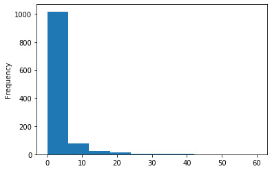


```python
df.boxplot(column='Total_Conversion', by='age')
```


    <matplotlib.axes._subplots.AxesSubplot at 0x1a1cefcda0>


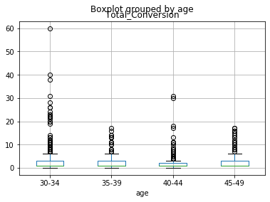


```python
df.plot(kind='scatter', x='Total_Conversion', y='Approved_Conversion', rot=70)
```


    <matplotlib.axes._subplots.AxesSubplot at 0x1a1d184c50>


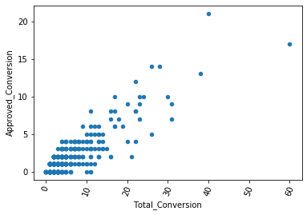


```python
df.Approved_Conversion.describe()
```


    count    1143.000000
    mean        0.944007
    std         1.737708
    min         0.000000
    25%         0.000000
    50%         1.000000
    75%         1.000000
    max        21.000000
    Name: Approved_Conversion, dtype: float64


```python
df.Approved_Conversion.plot('hist')
```


    <matplotlib.axes._subplots.AxesSubplot at 0x1a1d269208>


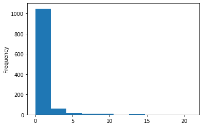


```python
df.plot(kind='scatter', x='Approved_Conversion', y='Clicks', rot=70)
```


    <matplotlib.axes._subplots.AxesSubplot at 0x1a1d269438>


```python
df.boxplot(column='Approved_Conversion', by='age')
```


    <matplotlib.axes._subplots.AxesSubplot at 0x1a1d4e57b8>


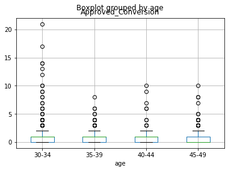


```python
df.gender.value_counts(dropna=False)
```


    M    592
    F    551
    Name: gender, dtype: int64


```python
df.xyz_campaign_id.value_counts(dropna=False)
```


    1178    625
    936     464
    916      54
    Name: xyz_campaign_id, dtype: int64


```python
df.fb_campaign_id.value_counts(dropna=False)
```


    144674    6
    144611    6
    144562    6
    144536    6
    144599    6
    144636    6
    144572    5
    144537    5
    144697    5
    144691    5
    144592    5
    144549    5
    144624    5
    144634    5
    144585    5
    144554    5
    144667    5
    144532    5
    144724    5
    144649    5
    144602    5
    144597    5
    144635    5
    144580    5
    144627    5
    144651    5
    144622    5
    144653    4
    144659    4
    144538    4
             ..
    179903    1
    179898    1
    179968    1
    179897    1
    116367    1
    179951    1
    104085    1
    179863    1
    179864    1
    179865    1
    179866    1
    179868    1
    179870    1
    179873    1
    123713    1
    123555    1
    116277    1
    179879    1
    179880    1
    116395    1
    104109    1
    179886    1
    179887    1
    179888    1
    116063    1
    110836    1
    179892    1
    123573    1
    179894    1
    144675    1
    Name: fb_campaign_id, Length: 543, dtype: int64


```python
df.corr()
```


<div>
<style scoped>
    .dataframe tbody tr th:only-of-type {
        vertical-align: middle;
    }

    .dataframe tbody tr th {
        vertical-align: top;
    }

    .dataframe thead th {
        text-align: right;
    }
</style>
<table border="1" class="dataframe">
  <thead>
    <tr style="text-align: right;">
      <th></th>
      <th>ad_id</th>
      <th>xyz_campaign_id</th>
      <th>fb_campaign_id</th>
      <th>interest</th>
      <th>Impressions</th>
      <th>Clicks</th>
      <th>Spent</th>
      <th>Total_Conversion</th>
      <th>Approved_Conversion</th>
      <th>Click_through_rate</th>
      <th>Click_conversion_rate</th>
      <th>Click_approved_conversion_rate</th>
      <th>Cost_per_click</th>
      <th>Cost_per_conversion</th>
    </tr>
  </thead>
  <tbody>
    <tr>
      <th>ad_id</th>
      <td>1.000000</td>
      <td>0.933700</td>
      <td>0.969538</td>
      <td>0.484262</td>
      <td>0.414394</td>
      <td>0.379463</td>
      <td>0.380043</td>
      <td>0.311385</td>
      <td>0.241573</td>
      <td>-0.482095</td>
      <td>-0.437292</td>
      <td>-0.279620</td>
      <td>0.353613</td>
      <td>0.281788</td>
    </tr>
    <tr>
      <th>xyz_campaign_id</th>
      <td>0.933700</td>
      <td>1.000000</td>
      <td>0.849948</td>
      <td>0.259762</td>
      <td>0.441748</td>
      <td>0.412159</td>
      <td>0.419713</td>
      <td>0.304421</td>
      <td>0.253374</td>
      <td>-0.514226</td>
      <td>-0.509963</td>
      <td>-0.318276</td>
      <td>0.433557</td>
      <td>0.346699</td>
    </tr>
    <tr>
      <th>fb_campaign_id</th>
      <td>0.969538</td>
      <td>0.849948</td>
      <td>1.000000</td>
      <td>0.636357</td>
      <td>0.381765</td>
      <td>0.345015</td>
      <td>0.340340</td>
      <td>0.304154</td>
      <td>0.223307</td>
      <td>-0.478003</td>
      <td>-0.406473</td>
      <td>-0.254988</td>
      <td>0.278786</td>
      <td>0.233346</td>
    </tr>
    <tr>
      <th>interest</th>
      <td>0.484262</td>
      <td>0.259762</td>
      <td>0.636357</td>
      <td>1.000000</td>
      <td>0.076271</td>
      <td>0.061969</td>
      <td>0.041747</td>
      <td>0.104589</td>
      <td>0.042204</td>
      <td>-0.179998</td>
      <td>-0.111849</td>
      <td>-0.054325</td>
      <td>-0.030467</td>
      <td>-0.020195</td>
    </tr>
    <tr>
      <th>Impressions</th>
      <td>0.414394</td>
      <td>0.441748</td>
      <td>0.381765</td>
      <td>0.076271</td>
      <td>1.000000</td>
      <td>0.944253</td>
      <td>0.967920</td>
      <td>0.805766</td>
      <td>0.681326</td>
      <td>-0.154910</td>
      <td>-0.358328</td>
      <td>-0.216329</td>
      <td>0.208556</td>
      <td>0.377097</td>
    </tr>
    <tr>
      <th>Clicks</th>
      <td>0.379463</td>
      <td>0.412159</td>
      <td>0.345015</td>
      <td>0.061969</td>
      <td>0.944253</td>
      <td>1.000000</td>
      <td>0.992319</td>
      <td>0.680365</td>
      <td>0.548723</td>
      <td>-0.036647</td>
      <td>-0.375337</td>
      <td>-0.226259</td>
      <td>0.112676</td>
      <td>0.484563</td>
    </tr>
    <tr>
      <th>Spent</th>
      <td>0.380043</td>
      <td>0.419713</td>
      <td>0.340340</td>
      <td>0.041747</td>
      <td>0.967920</td>
      <td>0.992319</td>
      <td>1.000000</td>
      <td>0.712991</td>
      <td>0.584499</td>
      <td>-0.064236</td>
      <td>-0.376613</td>
      <td>-0.226522</td>
      <td>0.165464</td>
      <td>0.471623</td>
    </tr>
    <tr>
      <th>Total_Conversion</th>
      <td>0.311385</td>
      <td>0.304421</td>
      <td>0.304154</td>
      <td>0.104589</td>
      <td>0.805766</td>
      <td>0.680365</td>
      <td>0.712991</td>
      <td>1.000000</td>
      <td>0.866971</td>
      <td>-0.162722</td>
      <td>-0.159273</td>
      <td>-0.103391</td>
      <td>0.160828</td>
      <td>-0.013342</td>
    </tr>
    <tr>
      <th>Approved_Conversion</th>
      <td>0.241573</td>
      <td>0.253374</td>
      <td>0.223307</td>
      <td>0.042204</td>
      <td>0.681326</td>
      <td>0.548723</td>
      <td>0.584499</td>
      <td>0.866971</td>
      <td>1.000000</td>
      <td>-0.153608</td>
      <td>-0.116582</td>
      <td>0.076783</td>
      <td>0.170040</td>
      <td>-0.040429</td>
    </tr>
    <tr>
      <th>Click_through_rate</th>
      <td>-0.482095</td>
      <td>-0.514226</td>
      <td>-0.478003</td>
      <td>-0.179998</td>
      <td>-0.154910</td>
      <td>-0.036647</td>
      <td>-0.064236</td>
      <td>-0.162722</td>
      <td>-0.153608</td>
      <td>1.000000</td>
      <td>0.052150</td>
      <td>0.043089</td>
      <td>-0.378854</td>
      <td>0.029323</td>
    </tr>
    <tr>
      <th>Click_conversion_rate</th>
      <td>-0.437292</td>
      <td>-0.509963</td>
      <td>-0.406473</td>
      <td>-0.111849</td>
      <td>-0.358328</td>
      <td>-0.375337</td>
      <td>-0.376613</td>
      <td>-0.159273</td>
      <td>-0.116582</td>
      <td>0.052150</td>
      <td>1.000000</td>
      <td>0.530920</td>
      <td>-0.325020</td>
      <td>-0.438034</td>
    </tr>
    <tr>
      <th>Click_approved_conversion_rate</th>
      <td>-0.279620</td>
      <td>-0.318276</td>
      <td>-0.254988</td>
      <td>-0.054325</td>
      <td>-0.216329</td>
      <td>-0.226259</td>
      <td>-0.226522</td>
      <td>-0.103391</td>
      <td>0.076783</td>
      <td>0.043089</td>
      <td>0.530920</td>
      <td>1.000000</td>
      <td>-0.127088</td>
      <td>-0.260491</td>
    </tr>
    <tr>
      <th>Cost_per_click</th>
      <td>0.353613</td>
      <td>0.433557</td>
      <td>0.278786</td>
      <td>-0.030467</td>
      <td>0.208556</td>
      <td>0.112676</td>
      <td>0.165464</td>
      <td>0.160828</td>
      <td>0.170040</td>
      <td>-0.378854</td>
      <td>-0.325020</td>
      <td>-0.127088</td>
      <td>1.000000</td>
      <td>0.133906</td>
    </tr>
    <tr>
      <th>Cost_per_conversion</th>
      <td>0.281788</td>
      <td>0.346699</td>
      <td>0.233346</td>
      <td>-0.020195</td>
      <td>0.377097</td>
      <td>0.484563</td>
      <td>0.471623</td>
      <td>-0.013342</td>
      <td>-0.040429</td>
      <td>0.029323</td>
      <td>-0.438034</td>
      <td>-0.260491</td>
      <td>0.133906</td>
      <td>1.000000</td>
    </tr>
  </tbody>
</table>
</div>


```python
plt.matshow(df.corr())
plt.xticks(range(len(df.columns)), df.columns)
plt.yticks(range(len(df.columns)), df.columns)
plt.colorbar()
plt.show()
```


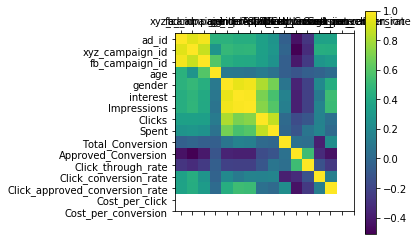


# THIS SECTION ADDS NEW METRICS TO DATA


```python
df['Click_through_rate'] = (df['Clicks']/df['Impressions'])*100 #This code creates the click through rate (CTR) column
```


```python
df['Click_conversion_rate'] = (df['Total_Conversion']/df['Clicks'])*100 #This code creates the conversion rate column
```


```python
df['Click_approved_conversion_rate'] = (df['Approved_Conversion']/df['Clicks']) *100 #This code creates the approved conversion rate column
```


```python
df['Cost_per_click'] = df['Spent']/df['Clicks'] #This code creates the cost per click column
```


```python
df['Cost_per_conversion'] = df['Spent']/df['Total_Conversion'] #This code creates the cost per conversion column
```

Some rows have infinite values set due to a conversion occuring with no clicks. 

Possible solution: pd.set_option('use_inf_as_na', True) can be used to turn infinite values to NaN


```python
df = df[np.isfinite(df['Click_conversion_rate'])] #removes observations that have conversion but no clicks
```

# THIS SECTION CONVERTS CATEGORICAL VARIABLES TO QUANTITATIVE


```python
df.loc[df.gender == 'M', 'gender'] = 1 #Converts male to numberic 1
```


```python
df.loc[df.gender == 'F', 'gender'] = 0 #Converts female to numberic 0
```


```python
df.loc[df.age == '35-39', 'age'] = 37 #average age of age group
```


```python
df.loc[df.age == '45-49', 'age'] = 47 #average age of age group
```


```python
df.loc[df.age == '30-34', 'age'] = 32 #average age of age group
```


```python
df.loc[df.age == '40-44', 'age'] = 42 #average age of age group
```

# THIS SECTION ATTEMPS TO NORMALIZE DATA - NOT SUCCESFUL 


```python
df["Clicks_normalized"] = df["Clicks"].apply(np.log)
df["Clicks_normalized"].hist()
```


    <matplotlib.axes._subplots.AxesSubplot at 0x107ca06d8>


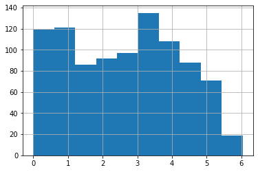


```python
df["Impressions_normalized"] = df["Impressions"].apply(np.log)
df["Impressions_normalized"].hist()
```


    <matplotlib.axes._subplots.AxesSubplot at 0x1a1d2b96a0>


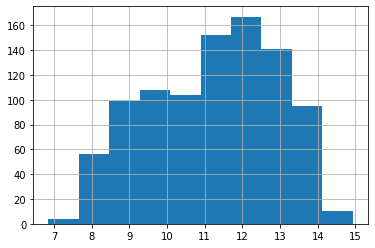


```python
df["Spent_normalized"] = df["Spent"].apply(np.log)
df["Spent_normalized"].hist()
```


    <matplotlib.axes._subplots.AxesSubplot at 0x1a1d2b9550>


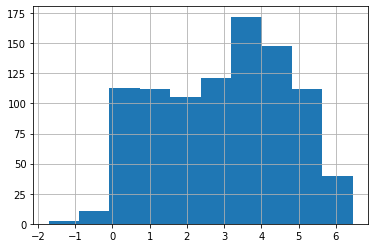


# Scaler Testing


```python
from sklearn.preprocessing import StandardScaler #test using scaler
scaler = StandardScaler()#test using scaler
```


```python

df_scaledtest = pd.DataFrame(scaler.fit_transform(df_test),columns=df_test.columns) #create test table
```


```python
df_test = df.loc[:, ['Clicks', 'Impressions','Total_Conversion']] #take two columns from standard table
```


```python
df_scaledtest.Clicks.hist() #data is scaled but not normalized
```


    <matplotlib.axes._subplots.AxesSubplot at 0x1a1de68a20>


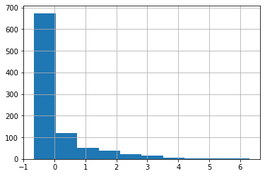


```python
#df["Impressions_normalized"].hist()
```


    <matplotlib.axes._subplots.AxesSubplot at 0x1a1e973d68>


```python
#df["Spent_normalized"] = df["Spent"].apply(np.log)
```


```python
#df["Total_Conversion"].hist()
```


    <matplotlib.axes._subplots.AxesSubplot at 0x1a1d29fd68>


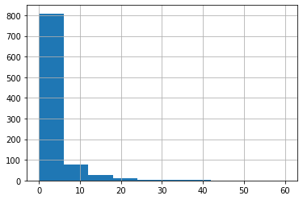


```python
#df["Total_Conversion_normalized"] = df["Total_Conversion"].apply(np.log)
```


```python
#df["Total_Conversion_normalized"].hist()
```

# START OF DECISION TREE CODE

Poor accuracy in this version.


```python
from sklearn.tree import DecisionTreeClassifier # Import Decision Tree Classifier
from sklearn.model_selection import train_test_split # Import train_test_split function
from sklearn import metrics #Import scikit-learn metrics module for accuracy calculation
```


```python
#split dataset in features and target variable

feature_cols = ['age','gender'] #feature variables
X = df[feature_cols] # Features
y = df.Total_Conversion # Target variable
```


```python
# Split dataset into training set and test set

X_train, X_test, y_train, y_test = train_test_split(X, y, test_size=0.3, random_state=1) # 70% training and 30% testx

```


```python
# Create Decision Tree classifer object
clf = DecisionTreeClassifier()

# Train Decision Tree Classifer
clf = clf.fit(X_train,y_train)

#Predict the response for test dataset
y_pred = clf.predict(X_test)

# Model Accuracy, how often is the classifier correct?
print("Accuracy:",metrics.accuracy_score(y_test, y_pred))
```

    Accuracy: 0.5195729537366548


```python
#Install pydotplus if not present 'pip install pydotplus'
```


```python
#pip install graphviz #install if not present
```

    Requirement already satisfied: graphviz in /anaconda3/lib/python3.7/site-packages (0.13)
    Note: you may need to restart the kernel to use updated packages.


```python
#conda install graphviz #install if not present
```


```python
from sklearn.tree import export_graphviz
from sklearn.externals.six import StringIO  
from IPython.display import Image  
import pydotplus

dot_data = StringIO()
export_graphviz(clf, out_file=dot_data,  
                filled=True, rounded=True,
                special_characters=True,feature_names = feature_cols,class_names=['0','1','2','3','4','5','7','8','9'])
graph = pydotplus.graph_from_dot_data(dot_data.getvalue())  
graph.write_png('socialmediadata.png')
Image(graph.create_png())
```


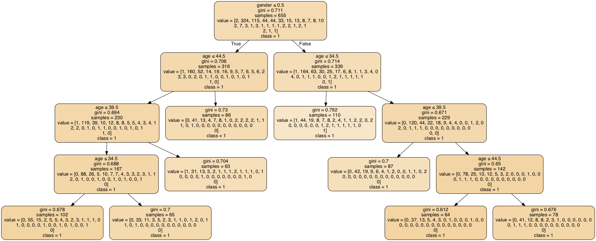


# START OF KNN CODE

Poor accuracy in this version


```python
# Import train_test_split function
from sklearn.model_selection import train_test_split


#split dataset in features and target variable

feature_cols = ['age','gender','interest','Spent'] #feature variables
X = df[feature_cols] # Features
y = df.Total_Conversion # Target variable


# Split dataset into training set and test set

X_train, X_test, y_train, y_test = train_test_split(X, y, test_size=0.3, random_state=1) # 70% training and 30% testx

```


```python
#Import knearest neighbors Classifier model
from sklearn.neighbors import KNeighborsClassifier

#Create KNN Classifier
knn = KNeighborsClassifier(n_neighbors=9)

#Train the model
knn.fit(X_train, y_train)

#Predict the response for test dataset
y_pred = knn.predict(X_test)
```


```python
#Import scikit-learn metrics module for accuracy calculation
from sklearn import metrics
# Model Accuracy
print("Accuracy:",metrics.accuracy_score(y_test, y_pred))
```

    Accuracy: 0.5124555160142349


# LOGISTRIC REGRESSION 

Data is not normalized so this does not work properly. I tried to normliaze data above, however, I am now getting continuous data errors.


```python
#split dataset in features and target variable
feature_cols = ['Impressions','Clicks','Spent']
X = df[feature_cols] # Features
y = df.Total_Conversion # Target variable
```


```python
# Split dataset into training set and test set
X_train, X_test, y_train, y_test = train_test_split(X, y, test_size=0.25, random_state=0) # 75% training and 25% testx
```


```python
# import the class
from sklearn.linear_model import LogisticRegression

# instantiate the model (using the default parameters)
logreg = LogisticRegression()

# fit the model with data
logreg.fit(X_train,y_train)

#
y_pred=logreg.predict(X_test)
```

    //anaconda3/lib/python3.7/site-packages/sklearn/linear_model/logistic.py:432: FutureWarning: Default solver will be changed to 'lbfgs' in 0.22. Specify a solver to silence this warning.
      FutureWarning)
    //anaconda3/lib/python3.7/site-packages/sklearn/linear_model/logistic.py:469: FutureWarning: Default multi_class will be changed to 'auto' in 0.22. Specify the multi_class option to silence this warning.
      "this warning.", FutureWarning)


```python
print("Accuracy:",metrics.accuracy_score(y_test, y_pred))
```

    Accuracy: 0.49572649572649574


```python

```
